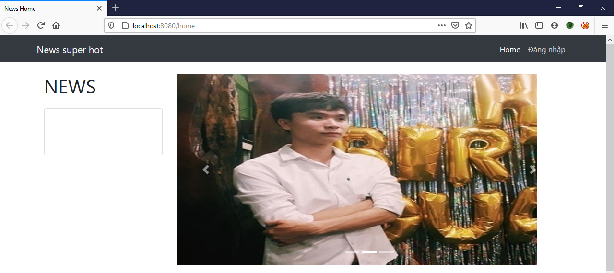
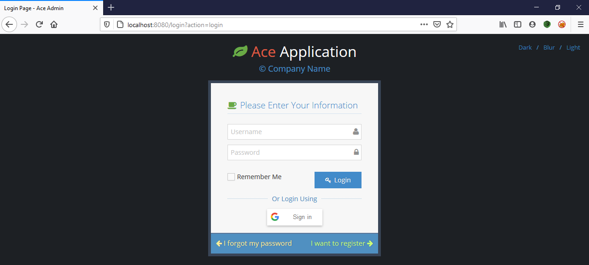
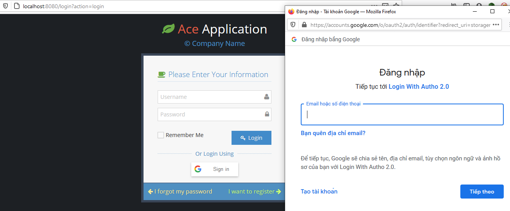
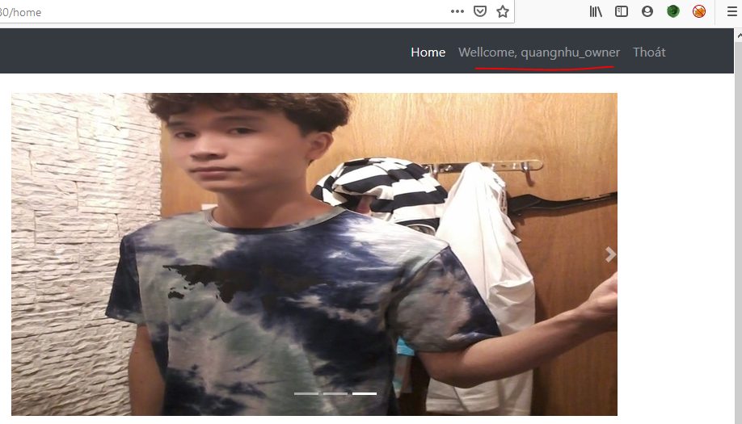
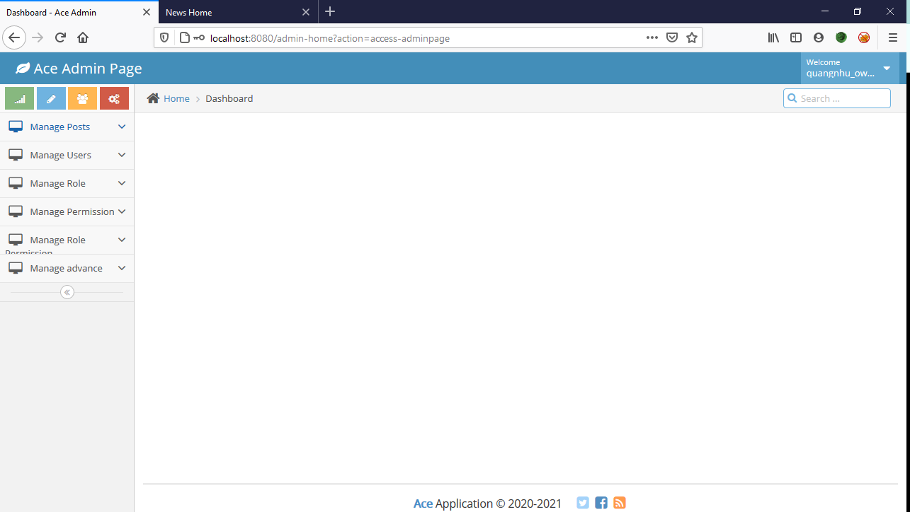
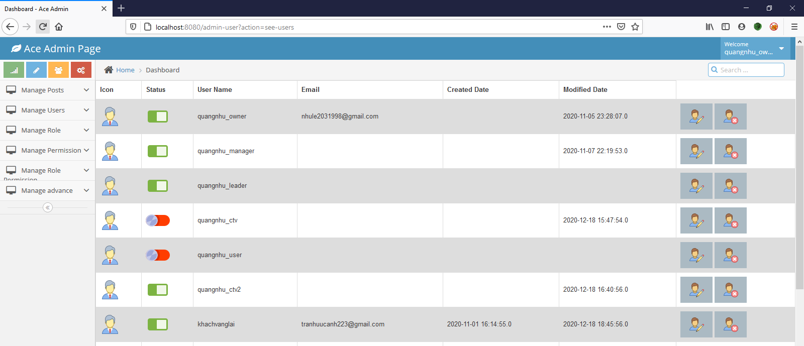
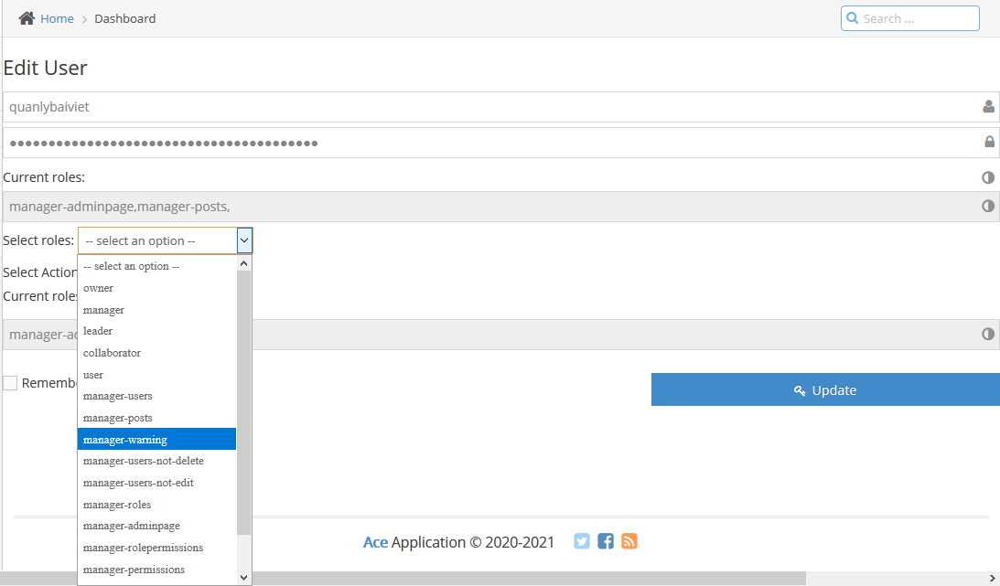
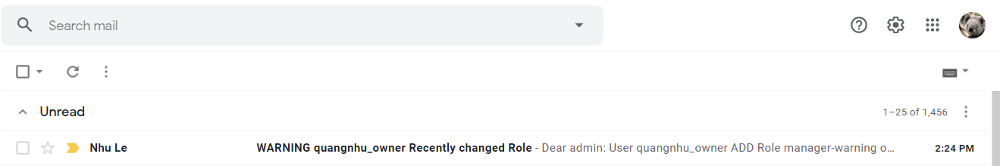
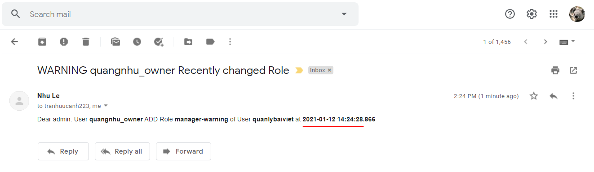
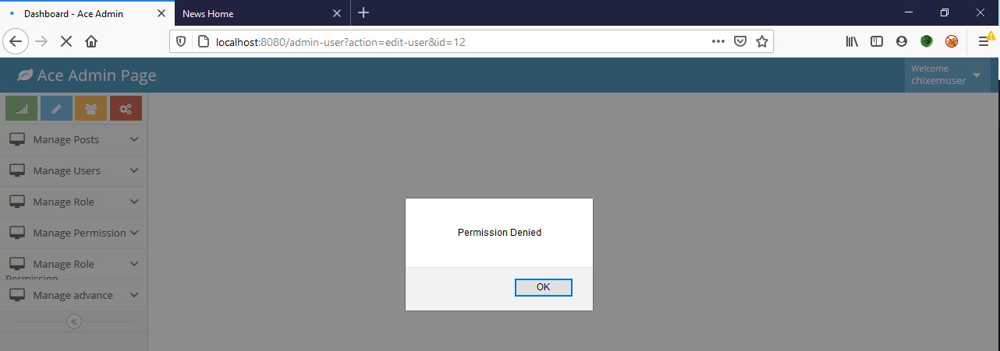

# Authorization-RBACmodel

### Feature: login with Google, authorization, send gmail

### Technical: my application use java language. this is J2EE, JSTL, model three tier, MVC and framework sitemesh decorator.

## Tracking-app-web
### Home page

### Login page

### Login with Google

### Home page (After Normal Login)

### Admin page

### List user

### Edit User page

### Warning to email

### Alert when user access into page not Privilege

